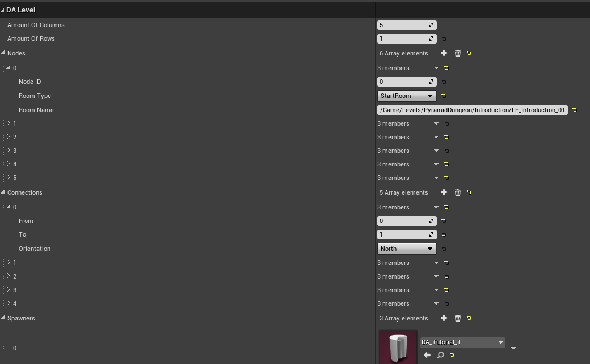
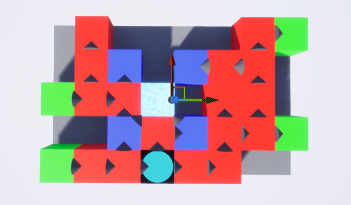
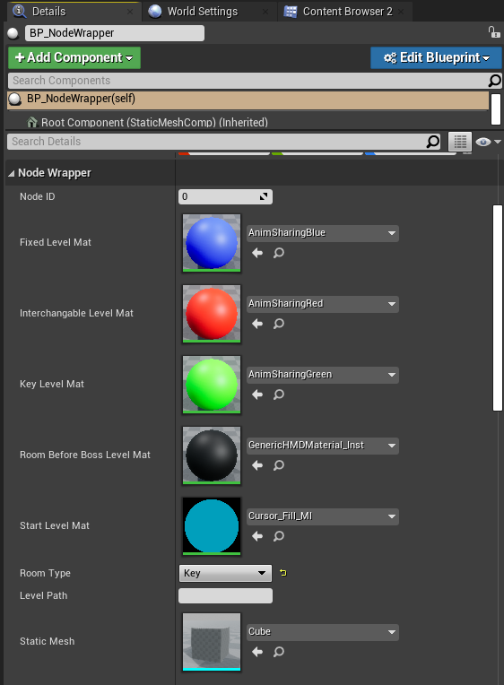

# Curse of the Pyramid

Curse Of The Pyramid is a single-player hack and slash, dungeon crawler, bullet hell roguelike with a unique twist: Soul Mode.
In Soul Mode you play as the soul version of yourself, not only having access to a different ability set but also you are able to interact with special gameplay elements. As the enemies are making also use of this system, you have to make quick decisions in your fighting style to make it out of every room alive. 

<iframe width="560" height="315" src="https://www.youtube.com/embed/us-wrjvyLB4" frameborder="0" 
allow="accelerometer; autoplay; encrypted-media; gyroscope; picture-in-picture" allowfullscreen></iframe>

This was a school project for the 3rd year of [Digital Arts and Entertainment](https://www.digitalartsandentertainment.be/){:target="_blank"} for the course group projects. 
This project also got shortlisted for the [Grads In Games Student Game (Group) Award 2022](https://gradsingames.com/news/grads-in-games-awards-2022-the-shortlist/){:target="_blank"}.

The project was developed by: 
- [Enrique Brossé](https://www.linkedin.com/in/enrique-brosse/){:target="_blank"} (Back-end, Tool, Optimization)
- [Steven Serra Mock](https://www.linkedin.com/in/stevenserramock/){:target="_blank"} (Director, Main Game Design, LookDev, Tech Art,  Character, VFX, SFX, Soundtrack-Composition)
- [Silke Van Der Smissen](https://www.linkedin.com/in/silke-van-der-smissen-41079920a){:target="_blank"} (Environment, Prop, LookDev, Tech Art, Lighting)
- [Bente Schoone](https://www.linkedin.com/in/benteschoone/){:target="_blank"} (Character, Rigging, Animation, UI, Prop, Cinematography)
- [Judith Verdonck](https://www.linkedin.com/in/judith-verdonck-33905b221){:target="_blank"} (Gameplay, AI, Optimization)

For this project I was responsible for the following features: 

- Making a system to spawn the semi random dungeon generator
- Making a system where enemies should spawn in the room
- Making the dialog system for interaction with the non playable characters
- Implementing the 4 puzzles to solve in the game 
- Implementing traps
- UI programming 

## The semi random dungeon generator 

The dungeon that you can play is semi random, this means that the dungeon has a predefined layout with some rooms that will always be there and some rooms that can be random, for example the puzzle rooms, start room and rooms that lead up to the center would always be there for the demo, everything else would be random rooms. The rooms also had some variation per run as we could replace some assets at runtime when loading in the level to make every experience unique when you play the game. 

### The layout tool 

The layout tool/ the level builder is a small tools that works as following: 

We have a data asset DA_Level where we have nodes and connections, where nodes and spawners. The nodes here are all the levels with an ID, then we have the connections which will connect the rooms with the correct direction of what door could open. The spawners are per room that you clear, this would make sure that we can control how difficult a room is. 

The level builder is the actor that will help fill in the data for DA_Level. It holds a grid that is the size of the node blocks * the rows/columns. It also holds the level data asset that we discussed before. This is the tool that will fill in all the data on where our levels will be placed and how they're connected. We do this by pressing the button on the asset called "Make Level".

Then we still have the node wrapper and the connection wrapper. These 2 will define what level get's spawned where and what the connection(s) are made. If we look at the image above you can see a lot of cubes, these will be the levels that spawn and what type of level could spawn. This is mostly done by the enum Room Type and level path. Whenever we change the enum value on this blueprint it'll change the blueprint color. If we a wanted a fixed room we would make the enum value for the variable "Room Type" fixed and fill in the asset name for room name 

The connection wrapper an an actor that will visualize the connection (arrows). This blueprint will also rotate by itself if you change the enum variable Orientation with options: (N,NE,E,SE,S, etc.). 

## The puzzles 

I was also responsible for implementing the puzzles that were designed by [Steven](https://www.linkedin.com/in/stevenserramock/){:target="_blank"}. Here are some video's on how to complete the puzzles. 

<iframe width="560" height="315" src="https://www.youtube.com/embed/sUfFDAuab_E" frameborder="0" allow="accelerometer; autoplay; encrypted-media; gyroscope; picture-in-picture" allowfullscreen></iframe>
<iframe width="560" height="315" src="https://www.youtube.com/embed/L6yrXnhD5nA" frameborder="0" allow="accelerometer; autoplay; encrypted-media; gyroscope; picture-in-picture" allowfullscreen></iframe>
<iframe width="560" height="315" src="https://www.youtube.com/embed/tl2wj8h22HQ" frameborder="0" allow="accelerometer; autoplay; encrypted-media; gyroscope; picture-in-picture" allowfullscreen></iframe>
<iframe width="560" height="315" src="https://www.youtube.com/embed/rOCN6sIt-J4" frameborder="0" allow="accelerometer; autoplay; encrypted-media; gyroscope; picture-in-picture" allowfullscreen></iframe>

